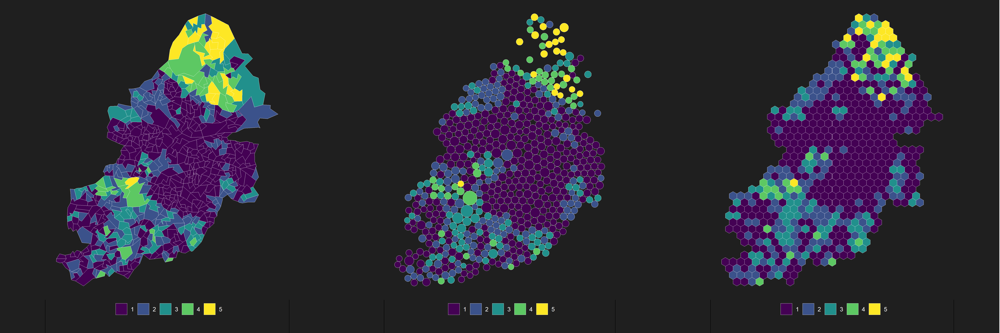
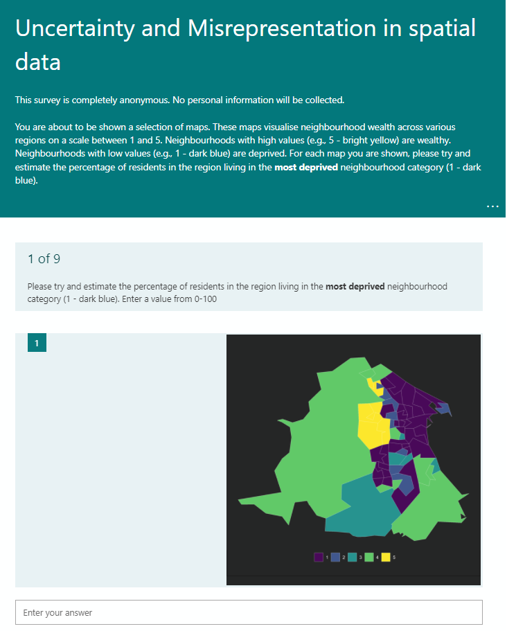

```{r setup, include=FALSE}
knitr::opts_chunk$set(echo = F, message = F, warning = F)
```


## Motivation

<h1 style="font-size:1vw">

<center>

Do people make **worse** estimates about the underlying data when observing the **original boundaries** of a map, in comparison to **alternative methods** (e.g., dorling cartograms, hex grids)?

</center> 

</h1>

## Data

- Multiple Index of Deprivation (2019)
- Lower Super Output Areas nested within Local Authorities
- Three of the top 10 most deprived Local Authorities
  - Birmingham
  - Hartelpool
  - Burnley
- Recoded 1-10 scale to 1-5
- Three map types:
  - Orignal
  - Hex grids (`geogrid`)
  - Dorling cartogram (`cartogram`)

<Br>

```{r, echo=FALSE, fig.align = "center", out.width="900px"}

```


## Survey

```{r, echo=FALSE, fig.align = "center", out.width="700px"}

```

## Results

```{r}
# results_df <- read_csv("data/")
```

